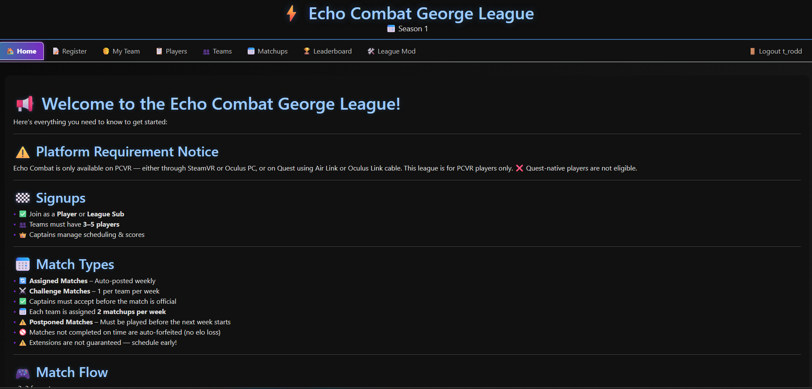
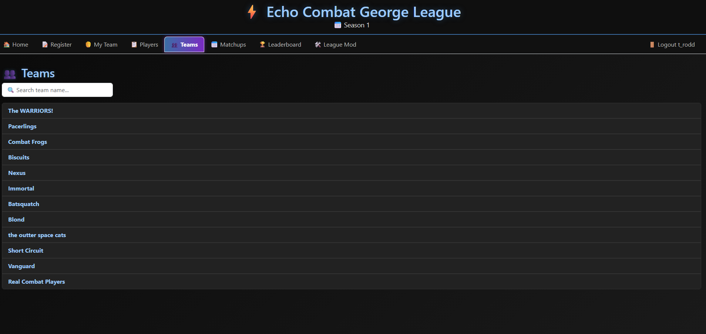
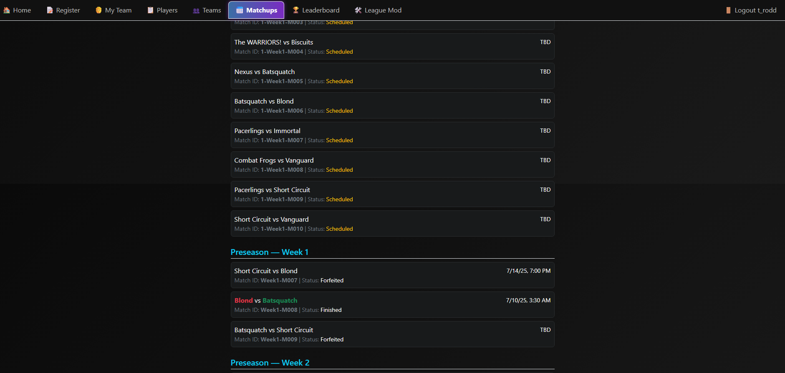
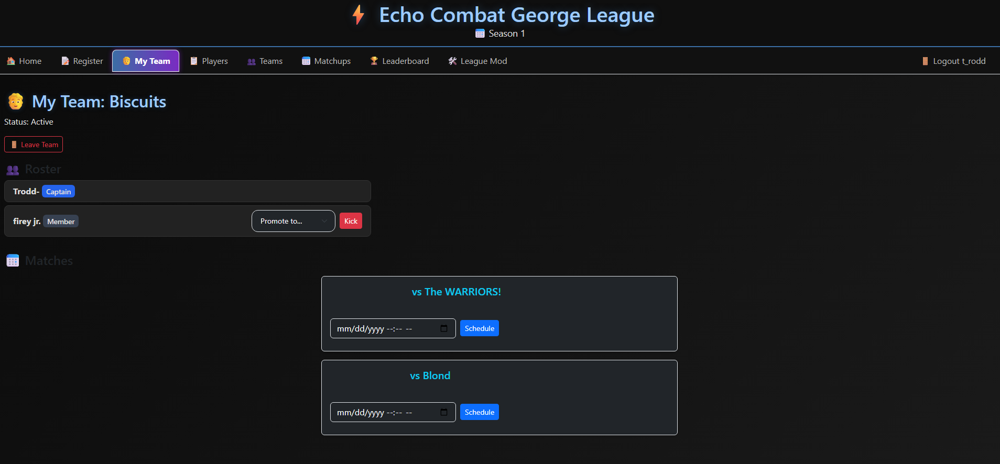
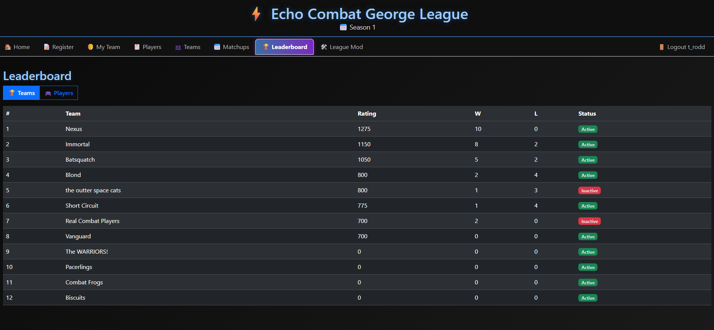
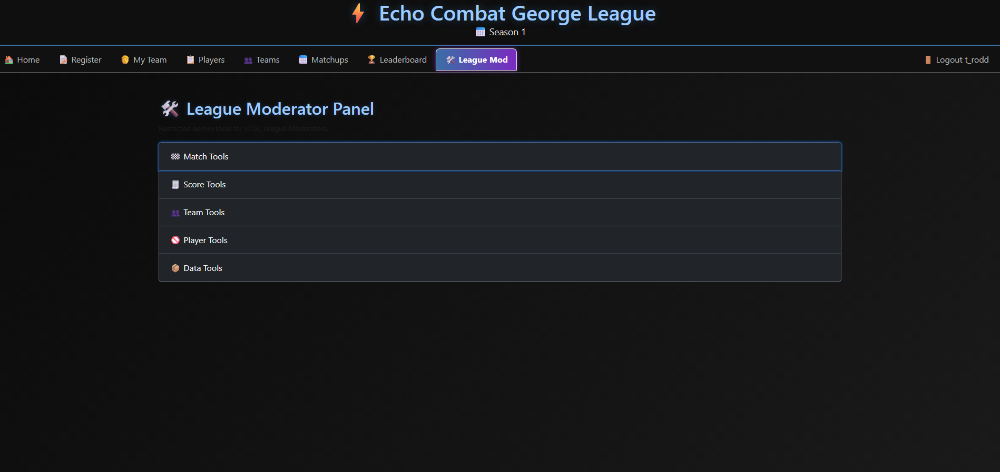

# ⚡ Echo Combat George League (ECGL)

> **A full-stack competitive league platform built for Echo Combat Community Edition (CE)**  
> Manage teams, schedule matches, submit scores, and track leaderboards — all in one place.

---

## 🏆 Overview

The **Echo Combat George League (ECGL)** is a **community-built competitive system** designed to keep the Echo Combat scene alive through organized leagues and tools that integrate directly with Discord and the Echo VRCE ecosystem.

It provides both players and moderators with powerful features:
- Player registration & role validation (Player / League Sub)
- Team management with captains, co-captains, and members
- Automated weekly match generation
- Real-time match scheduling and score submission
- Dynamic ELO-based leaderboards for teams and players
- Persistent season and player history tracking
- Secure mod panel with reset, disband, and ban controls

---

## 🎮 Features at a Glance

### 👥 Teams & Players
- Create or join teams of **3–5 players**
- Team captains manage scheduling and rosters
- League subs can fill in for matches when needed
- Disbanded teams remain in history but are hidden from active lists

### 📅 Matches
- **Assigned Matches** — Automatically generated weekly  
- **Challenge Matches** — Optional, player-initiated challenges  
- Match scheduling built directly into the dashboard  
- Scores submitted and confirmed via Propose Score system  
- Matches display in both **team detail** and **public matchups**

### 🧩 League Mod Panel
League moderators can:
- Adjust ratings  
- Forfeit or reset matches  
- Disband teams (marks as “Disbanded”)  
- Ban or unban players  
- Archive seasons to JSON or CSV  

All with built-in Discord OAuth authentication and role verification.

---

## 🎨 User Interface

| Page | Screenshot |
|:--|:--|
| 🏠 **Home** |  |
| 👥 **Teams** |  |
| 📅 **Matchups** |  |
| 🧑 **My Team** |  |
| 🏆 **Leaderboard** |  |
| 🛠️ **Mod Panel** |  |

---

## 🧠 Data Model Overview

- **Players** — Registered via Discord OAuth  
- **Teams** — Hold members, matches, and ratings  
- **Matches** — Include week, season, and result data  
- **Match Scores** — Per-map results with gamemode  
- **Player History** — Tracks team membership across seasons  

All actions cascade safely — e.g., when teams disband, they’re marked `Disbanded` instead of deleted, preserving historical accuracy.

---

## 💬 Community & Credits

The ECGL project is powered by and for the **Echo Combat CE community**, preserving competitive Echo VR gameplay after Meta’s shutdown.

Need help getting started with Echo VRCE?  
- [Echo VR Lounge](https://discord.gg/923ckhTxpf) – main hub  
- [Echo Academy](https://discord.gg/zAdJtPc9Jn) – training & tutorials  
- [Echo Ranked](https://discord.gg/CSBEzKTtqd) – competitive community  
- [0 Gravity League](https://discord.gg/47wK4UQgyW) – cross-league network  

---

## ❤️ Built With

- **Frontend:** React + Vite + Bootstrap  
- **Backend:** Go (GORM + Gorilla Mux)  
- **Database:** PostgreSQL  
- **Auth:** Discord OAuth2  
- **Hosting:** HTTPS via autocert  
- **Design:** Dark mode, PWA-ready, mobile optimized  

---

> _Made with passion by the ECGL Team_  
> © 2025 Echo Combat George League  
> _For the community, by the community._

